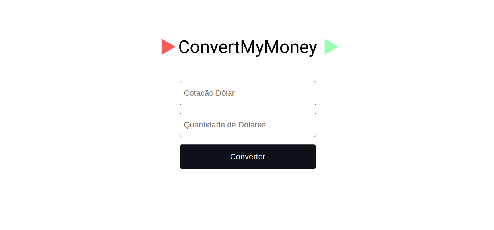
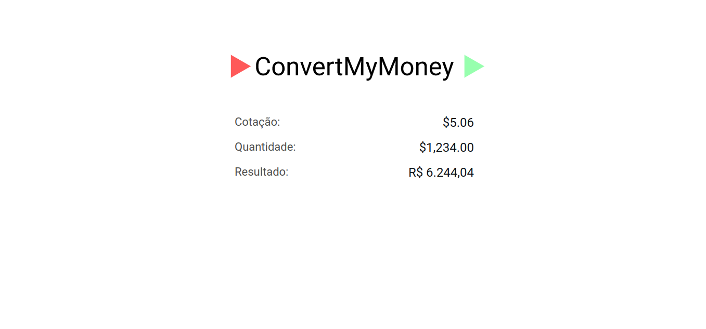

Esta é a minha versão do projeto <b>Convert My Money</b> proposto pelo curso Fullstack Master da plataforma [Devpleno](https://devpleno.com/). O projeto tem como objetivo calcular a cotação do dólar.

A aplicação foi desenvolvida com <b>NodeJS, EJS, CSS, Axios, Jest (Para efetuar testes unitários), [Api de Cotação](https://docs.awesomeapi.com.br/api-de-moedas)</b> e foram utilizadas features como, <b>String.prototype, Intl.NumberFormat </b> e entre outros.

Website: [Convert My Money](https://convertmymoney-nodejs.onrender.com/)




#### Executando ⚙️

```sh

# Clone
$ git clone https://github.com/EricNeves/convertMyMoney-01.git

# Install dependencies
$ cd convertMyMoney-01 && pnpm install

# Start
$ pnpm start
# Run dev
$ pnpm run dev
# Testing
$ pnpm test

```

#### Ferramentas 🛠

   * NodeJS
     * Express
     * EJS
     * Axios
     * Path
     * Jest
  * Style
     * CSS

#### License

